# Architecture Documentation

## Network Architecture Diagram

```mermaid
graph TB
    subgraph Internet["🌐 Internet"]
        WebClients["💻 Web Clients<br/>Browser Access<br/>Port 8065"]
    end
    
    subgraph Azure["Microsoft Azure Cloud"]
        subgraph RG["Resource Group: GreaterLearning"]
            subgraph VNet["Virtual Network: Project3<br/>Address Space: 10.0.0.0/16"]
                
                subgraph PublicSubnet["🟢 Public Subnet: 10.0.0.0/28"]
                    NSG1["🛡️ NSG: PubMattMostSvr-nsg<br/>• Allow SSH (22) from Internet<br/>• Allow HTTP (80) from Internet<br/>• Allow Mattermost (8065) from Internet<br/>• Allow outbound to MySQL subnet"]
                    PubVM["🖥️ PubMattMostSvr<br/>━━━━━━━━━━━━━━━<br/>Private IP: 10.0.0.4<br/>Public IP: 130.131.225.36<br/>OS: Ubuntu 24.04<br/>━━━━━━━━━━━━━━━<br/>Open Ports: 22, 80, 8065<br/>Service: MatterMost"]
                end
                
                subgraph PrivateSubnet["🔴 Private Subnet: 10.0.0.16/28<br/>⚠️ No Internet Access"]
                    NSG2["🛡️ NSG: PrivMySqlSvr-nsg<br/>• Allow MySQL (3306) from 10.0.0.4 ONLY<br/>• Deny all inbound from Internet<br/>• Deny all outbound to Internet"]
                    PrivVM["🗄️ PrivMySqlSvr<br/>━━━━━━━━━━━━━━━<br/>Private IP: 10.0.0.20<br/>No Public IP<br/>OS: Ubuntu 24.04<br/>━━━━━━━━━━━━━━━<br/>Open Port: 3306<br/>Service: MySQL 8.0<br/>Database: mattermost<br/>User: mmuser"]
                end
                
            end
        end
    end
    
    WebClients -->|"HTTP/HTTPS<br/>Port 8065"| PubVM
    PubVM -->|"MySQL Protocol<br/>Port 3306"| PrivVM
    
    NSG1 -.->|"Protects"| PubVM
    NSG2 -.->|"Protects"| PrivVM
    
    style Internet fill:#E3F2FD
    style Azure fill:#FFF3E0
    style RG fill:#FFEBEE
    style VNet fill:#F3E5F5
    style PublicSubnet fill:#E8F5E9
    style PrivateSubnet fill:#FFEBEE
    style PubVM fill:#81C784
    style PrivVM fill:#E57373
    style NSG1 fill:#64B5F6
    style NSG2 fill:#EF5350
```



## Architecture Overview

This architecture implements a secure, two-tier application deployment on Microsoft Azure with the following key components:

### 🔐 Security Layers

#### 1. Network Segmentation
- **Public Subnet (10.0.0.0/28)**: Houses the MatterMost web server with controlled internet access
- **Private Subnet (10.0.0.16/28)**: Completely isolated database tier with no internet connectivity

#### 2. Network Security Groups (NSGs)
- **PubMattMostSvr-nsg**: Controls inbound/outbound traffic for the web tier
- **PrivMySqlSvr-nsg**: Enforces strict access control allowing only database traffic from 10.0.0.4

#### 3. Firewall Rules
- Granular port-based access control
- Source IP filtering
- Default deny-all rules with explicit allow statements

### 📊 Traffic Flow

```
User Request Flow:
1. User → Internet → Azure Public IP (130.131.225.36:8065)
2. Traffic hits PubMattMostSvr-nsg (security check)
3. Allowed traffic reaches PubMattMostSvr (10.0.0.4)
4. MatterMost app processes request

Database Query Flow:
1. MatterMost (10.0.0.4) → PrivMySqlSvr-nsg (security check)
2. Traffic allowed from 10.0.0.4 only
3. MySQL server (10.0.0.20) processes query
4. Response returns through same path
```

### 🎯 Security Principles Implemented

| Principle | Implementation |
|-----------|----------------|
| **Defense in Depth** | Multiple security layers (NSGs, subnet isolation, firewall rules) |
| **Least Privilege** | MySQL only accessible from specific source IP (10.0.0.4) |
| **Network Segmentation** | Separate subnets for different security zones |
| **Zero Trust** | All traffic explicitly denied unless specifically allowed |
| **Attack Surface Minimization** | Database has no internet connectivity |

### 🔢 IP Address Allocation

| Resource | Private IP | Public IP | Subnet |
|----------|-----------|-----------|---------|
| PubMattMostSvr | 10.0.0.4 | 130.131.225.36 | 10.0.0.0/28 |
| PrivMySqlSvr | 10.0.0.20 | None (isolated) | 10.0.0.16/28 |

### 📡 Port Configuration

#### Public VM (PubMattMostSvr)
- **Port 22**: SSH administration
- **Port 80**: HTTP (redirect to HTTPS)
- **Port 8065**: MatterMost application

#### Private VM (PrivMySqlSvr)
- **Port 3306**: MySQL database (restricted to 10.0.0.4)

### 🛡️ NSG Rule Details

#### PubMattMostSvr-nsg Rules

**Inbound Rules:**
```
Priority 100: Allow SSH from Internet
Priority 110: Allow HTTP from Internet
Priority 120: Allow MatterMost (8065) from Internet
Priority 65500: Deny All (Azure default)
```

**Outbound Rules:**
```
Priority 100: Allow MySQL traffic to 10.0.0.16/28
Priority 65500: Allow Internet (Azure default)
```

#### PrivMySqlSvr-nsg Rules

**Inbound Rules:**
```
Priority 100: Allow MySQL (3306) from 10.0.0.4 ONLY
Priority 110: Deny all from Internet
Priority 65500: Deny All (Azure default)
```

**Outbound Rules:**
```
Priority 100: Deny Internet
Priority 65500: Azure platform traffic
```

### 🏗️ High Availability Considerations

While this is a single-instance deployment for demonstration purposes, production implementations could enhance availability through:

- Azure Availability Zones
- Load Balancers for the web tier
- Azure Database for MySQL (PaaS)
- Azure Backup for data protection
- Auto-scaling for the web tier
- Geographic redundancy

### 💰 Cost Optimization

Resources used in this architecture:
- 2x B1s Virtual Machines (burstable, cost-effective for development)
- 1x Virtual Network (free within Azure)
- 2x Network Security Groups (free)
- 1x Public IP Address (minimal cost)
- Standard SSD storage for VMs

### 📈 Scalability Path

Future enhancements for production workloads:

1. **Web Tier Scaling**
   - Add Azure Load Balancer
   - Deploy multiple MatterMost instances
   - Implement session persistence

2. **Database Tier Scaling**
   - Migrate to Azure Database for MySQL (managed service)
   - Implement read replicas
   - Enable automatic backups

3. **Monitoring & Observability**
   - Azure Monitor integration
   - Application Insights
   - Log Analytics workspace
   - Custom alerts and dashboards

---

## Additional Diagrams

### Deployment Sequence


### Security Model


---

**Note**: This architecture follows Azure best practices for securing multi-tier applications and demonstrates enterprise-grade security implementation suitable for production workloads.
